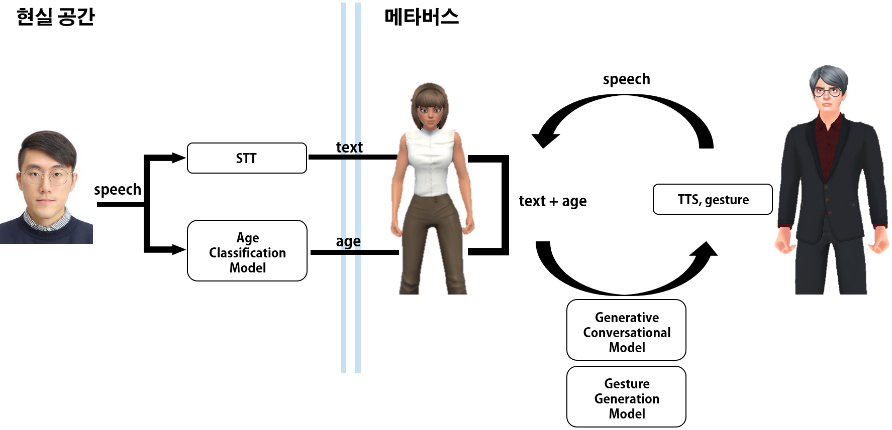

# Generative Conversational Model Considering Age In the Metaverse (메타버스에서 연령을 고려한 대화 생성 모델)

&nbsp;
## 🎈 __Subject__
### 1. 추진배경
* 메타버스에 대한 수요가 커지면서 다양한 영역에서 가상인간이 등장하고 있다. 가상인간은 인간들의 물리적인 한계를 보완할 수 있어 부가가치가 크고 시장에서의 성장 가능성도 무한하다. 
* 기업들은 가상인간을 영구적이고 영속적인 비즈니스 파트너로 활용 가능하다고 말한다. 하지만 가상인간과 사용자의 아바타가 원활하게 상호작용을 하기 위해서는 아직 해결해야 할 문제가 많다.
* 현재, 메타버스에서 사용자와 가상인간의 대화 상호작용은 텍스트 중심으로 이루어 지고 있다. 그러나 양자간에는 더욱 사실적인 경험이 필요하다고 보이며, 이를 위해서는, 사용자의 상태를 고려한 실시간 멀티모달 대화 생성 시스템이 요구된다.

|LG전자가 인공지능 기술을 활용해 기획해 만든 가상인간 김레아|
|:---:|
||
   

### 2. flowchart
* 검은옷 : 메타버스 안에서 나를 대신할 아바타, 흰색옷 : 나와 상호 작용할 아바타
   * 웹캠을 통해 사용자의 얼굴을 입력 받으면 감정분류 모델에서 감정을 분류하여 내 케릭터 표정을 맵핑합니다.
   * 사용자가 발화를 하면 음성을 STT api를 사용하여 텍스트로 변환하는 동시에 연령분류모델을 통해 연령층이 분류됩니다.
   * 발화한 텍스트와 ㅇ녀령을 기반으로 대화생성모델에서 대화를 생성합니다. 생성된 대화는 TTS api를 사용하여 가상인간이 발화 할 수 있도록 합니다.
      
|flowchart|
|:---:|
||

&nbsp;
## 🎈 __Information__
### 1. Age Classification Model - 사용자의 음성으로부터 나이를 예측하는 모델
* 5세부터 89세로 구성된 한국인 음성 데이터를 torch.audio를 사용해 mel-spectrogram으로 변환 후 학습 하여 Age Classification Model 생성
* 사용자의 음성을 실시간으로 입력받아 wav파일을 생성 후 mel-spectrogram으로 변환 후 사용자의 나이를 예측 및 child, adult, senior (각각 5-19세, 20-59세, 60-89세)로 분류

|Age Classification Process|
|:---:|
||

### 2. Generative Conversational Model - KoGPT2를 Fine Tuning하여 개발한 모델
* 데이터의 Q 필드를 <usr>발화, A 필드를 <sys>발화 그리고 Age 레이블을 <sent>로 매핑해 P(<sys>|<usr>, <sent>)를 최대화 할 수 있는 모델 생성
* 사용자의 음성을 STT api를 사용해서 텍스트로 변환하고, Age 레이블을 attach 하여 대화생성 모델에 입력, 생성된 대화를 TTS api를 사용해 음성으로 출력

|Generative Conversational Model|
|:---:|
||

### 3. Emotion Classification Model – 사용자의 얼굴로부터 표정을 분류하는 모델
* 7가지의 감정으로 구성된 얼굴표정 데이터셋을 사용해 Emotion Classification Model 생성
* 웹캠을 통해 사용자의 이미지를 실시간으로 입력받아 Emotion Classification Model로 사용자의 표정을 분류하여 아바타에 맵핑

|Emotion Classification Model|
|:---:|
||

      
      
